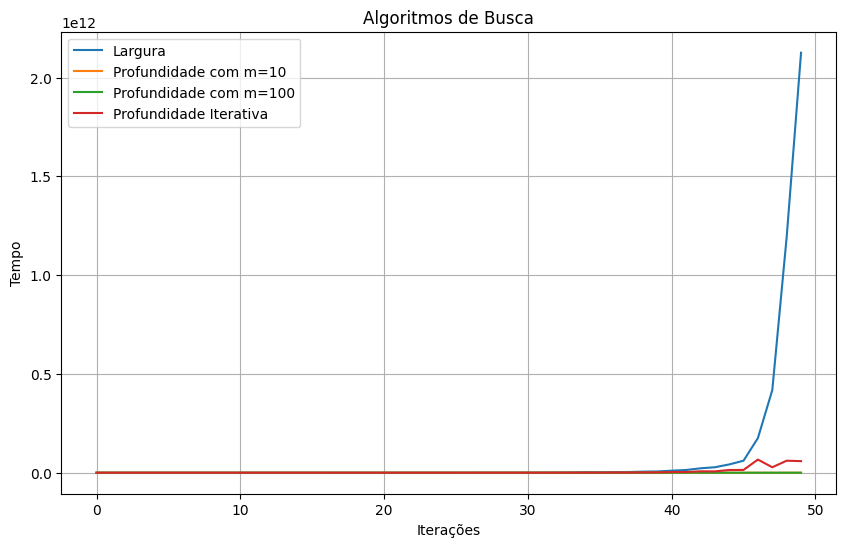
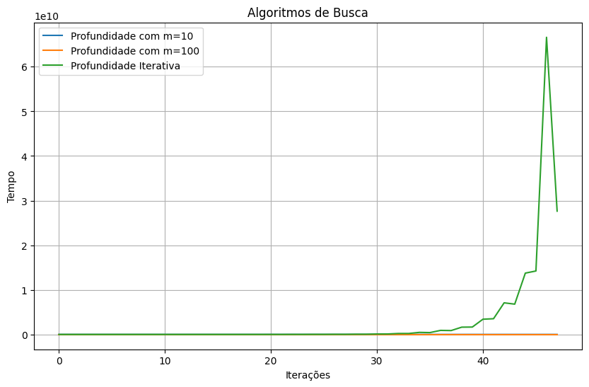
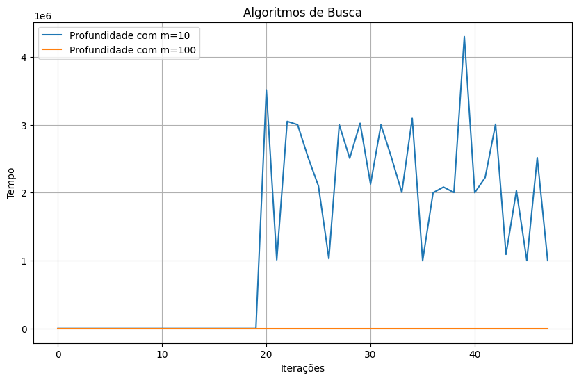

# Algoritmos de Busca por Gustavo Colombi Ribolla

# Introdução

Algortimos rodados no arquivo main.ipynb, juntamente com o Plot do gráfico pedido. Arquivo requirements.txt com todas as bibliotecas a serem instaladas para a aplicação.

## 1- Segundo o que discutimos em sala de aula, quais destes algoritmos são ótimos? Os resultado encontrados neste exercício são coerentes com esta informação? Justifique a sua resposta.

Como elaborado em sala, os algoritmos ótimos, são aqueles que encontram solução com menor custo, ou seja, os algoritmos completos são os de Busca em Largura e Busca de Profundidade Iterativa. Os resultados em minha visão não foram totalmente coerentes, pelo tempo de demora ao processar a Busca em Largura, por exemplo, para os valores de i mais altos, principalemnte o 50.

## 2- Segundo o que discutimos em sala de aula, quais destes algoritmos são completos? Os resultado encontrados neste exercício são coerentes com está informação? Justifique a sua resposta.

Como discutido em sala de aula, os algoritmos completos, são aqueles que acham soluções, ou seja, os algoritmos completos são os de Busca de Largura e o Busca de Profundidade Iterativa, entretando, para os testes aplicados, o algortimo de Busca em Profundidade com m = 100 também encontrou solução para todos os valores de i, se mostrando ótimo para essa ocasião. O Busca de Profundidade com m = 10 não se mostrou completo, pois quanto maior ficou o valor de m, a busca não foi encontrada.

## 3- Teve algum algoritmo que travou por falta de memória no seu computador? Se sim, qual é a explicação?

Em um primeiro teste, o algoritmo de Busca Iterativa deu problemas de memória, pois no caso do Busca Iterativa, o algoritmo checa todos os valores para encontrar com precisão, para isso, constrói mais nodos e consequentemente usa mais memória, mas com mais testes foi possível realizar a busca por esse algoritmo, que conseguiu encontrar todos os valores, por ser uma busca mais completa.

## 4- Qual é o algoritmo que tem um tempo de processamento menor? Justifique a sua resposta.

O algoritmo que obteve tempo de processamento menor foi o de Busca em Profundidade, sendo a Busca em Profundidade com m=100 com tempo nulo e encontrando todos os valores, como exemplificado nos gráficos abaixo. O algoritmo de Largura obteve tempo de processamento maior, pois o nodo de menor profundidade mais a esquerda é escolhido para gerar sucessores, o que não ocorre com o Busca em Profundidade, que o nodo escolhido é o maior, gerando um tempo de exploração de O($b^{2}$).

# Gráficos

Realizei o Plot de 3 gráficos para melhor compreensão. Como o Busca em Largura demorou bem mais tempo para rodar que os demais, fiz um gráfico com os 4 algoritmos, em seguida com os 3 (Profundidade com m=10, Profundidade com m=100 e Profundidade Iterativa) e no final com os 2 de Profundidade, que obtiveram tempos parecidois, para que a análise seja mais profunda.

## 1- Gráfico Completo de Algoritmos de Busca

## 2- Gráfico de Algoritmos de BP e BPI

## 3- Gráfico de Algoritmos de Busca de Profundidade
